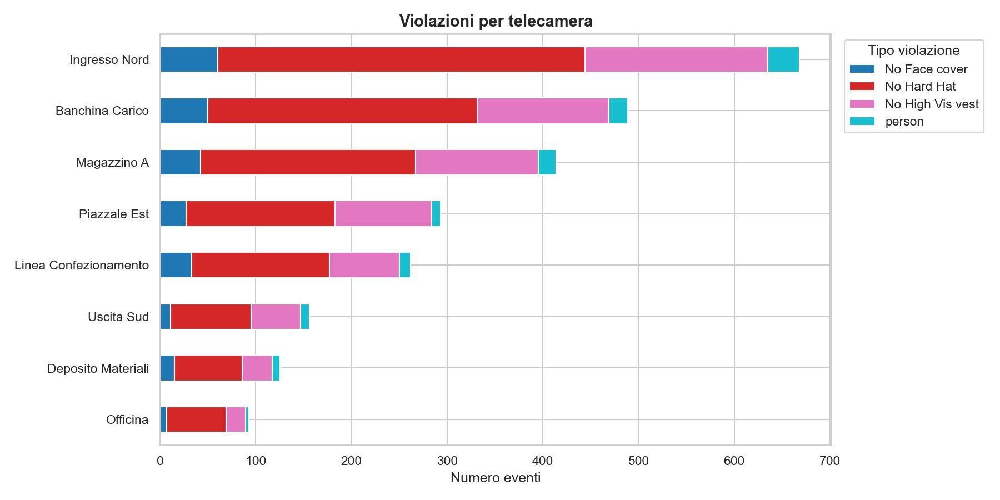
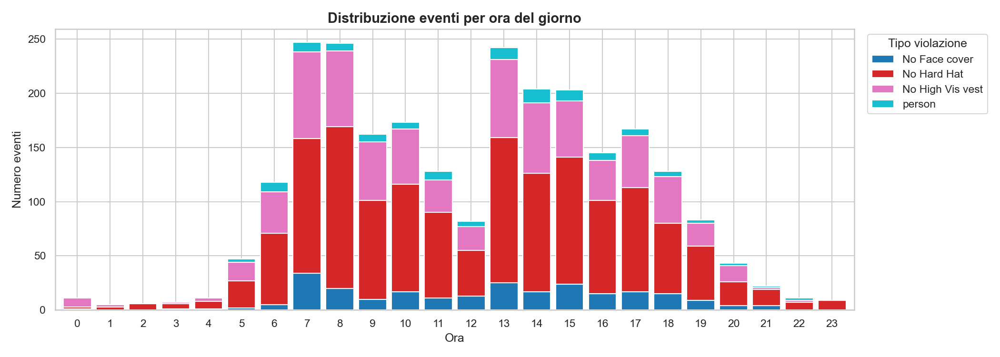
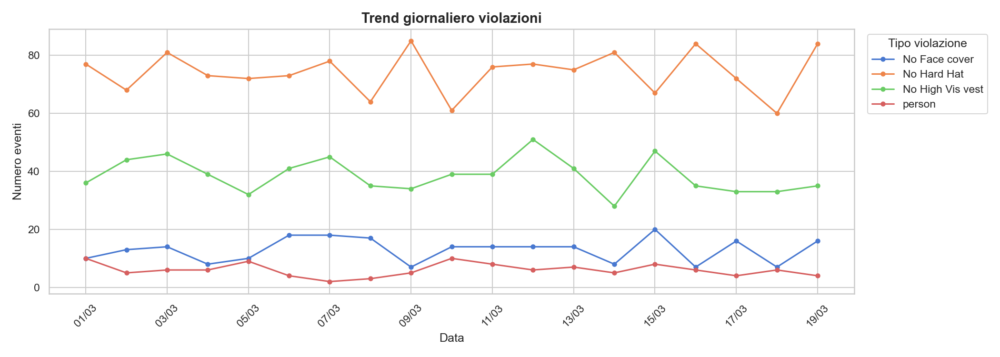
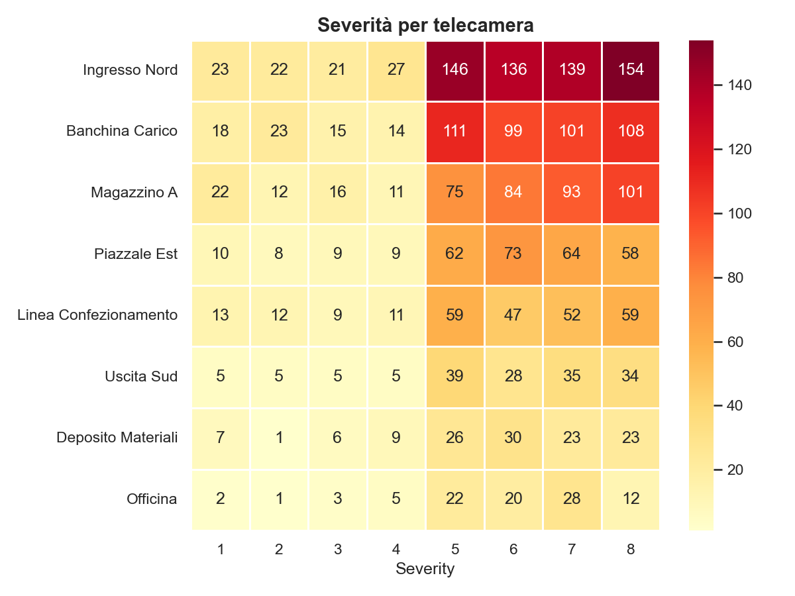
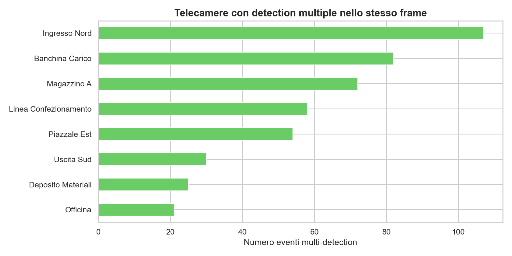
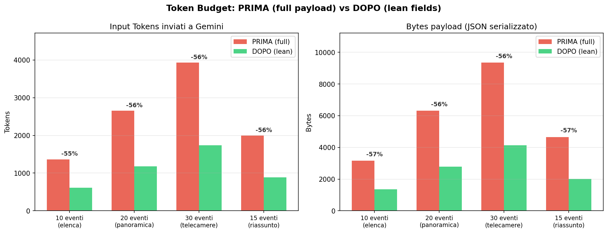

# Safety Agent

Agente LLM sperimentale per l'analisi di eventi di sicurezza sul lavoro rilevati da un sistema di computer vision (telecamere CCTV). L'utente chiede in linguaggio naturale, l'agente interroga il database tramite strumenti MCP e risponde alle richieste.

## Obiettivo

I sistemi di computer vision producono migliaia di eventi (violazioni DPI, severità, rilevazioni per frame) che nessun essere umano ha voglia di scorrere a mano. L'obiettivo è dare una panoramica di tutto ciò che mette in pericolo dipendenti e strutture, in tempo reale, semplicemente chiedendolo: conteggi, filtri per camera/tipo/severità/data, trend temporali e generazioni di grafici per visualizzare in modo ottimale la distribuzione degli eventi.

Il punto chiave: il modello **non riceve mai il dump del database**. Riceve solo strumenti per interrogarlo. Questo garantisce risposte fondate sui dati, costi di token sotto controllo e privacy (il modello vede solo ciò che serve alla domanda).

## Architettura

```
UI (chat web)  →  FastAPI  →  Agente (Gemini 2.5 Flash)  →  MCP server  →  PostgreSQL
```

Quattro pezzi, ognuno con un compito solo:

- **MCP server** ([src/mcp-server.py](src/mcp-server.py)) — espone il database come strumenti via Model Context Protocol (FastMCP). Strumenti primitivi (`get_event_by_id`, `list_events`), aggregazioni (`count_events`, `group_by_count`, `average_severity`, `events_per_day`, `events_by_hour`) e una risorsa `db://schema` che descrive al modello lo schema *live* del DB: camere e tipi di evento reali, non inventati.
- **Agente** ([agent/core.py](agent/core.py)) — collega Gemini al server MCP via stdio. All'avvio legge `db://schema` e lo inietta nel system prompt, così il modello sa cosa può chiedere prima ancora di chiamare un tool.
- **API** ([api/app.py](api/app.py)) — FastAPI con endpoint `/chat`, `/stats` e `/chat/reset`. Il server MCP vive nel lifespan dell'app: un processo solo, condiviso tra le richieste.
- **Database** ([db/models.py](db/models.py)) — PostgreSQL via SQLAlchemy. Due tabelle: `safety_events` (camera, tipo, severità 1-10, reviewed) e `event_detections` (una riga per persona/veicolo nel frame, con confidence). I dati arrivano dal CSV in `data/` tramite [data-cleaning/import_to_db.py](data-cleaning/import_to_db.py).

### Controllo dei token

I tool restituiscono di default solo i campi essenziali (modalità *lean*) e mai più di 20 righe — se servono i dettagli, il modello li chiede esplicitamente. La cronologia chat viene potata agli ultimi 2 turni utente. Sembrano dettagli, ma sono la differenza tra un agente economico e uno che brucia il budget per dire "ciao".

## Risultati

### Analisi esplorativa dei dati

I grafici qui sotto sono **esempi generati da dati sintetici** ([data-cleaning/generate_demo_plots.py](data-cleaning/generate_demo_plots.py)): nomi delle telecamere e numeri sono inventati, servono solo a mostrare il tipo di analisi prodotta. Le stesse visualizzazioni girano sul dataset reale (privato, non incluso nel repo) tramite [data-cleaning/visualize.py](data-cleaning/visualize.py):

| | |
|---|---|
|  |  |
|  |  |



### Benchmark sui token

Confronto tra payload FULL (tutti i campi) e LEAN (solo i campi richiesti dalla query) su query reali ([tests/run_benchmark.py](tests/run_benchmark.py)). Il filtro lato server riduce sensibilmente i token in input a parità di qualità della risposta:



Il report completo (HTML) viene generato in locale da [tests/benchmark_token_MinMax/generate_report.py](tests/benchmark_token_MinMax/generate_report.py) e non è incluso nel repo perché contiene estratti del dataset.

## Avvio rapido

```bash
# 1. Variabili d'ambiente (GEMINI_API_KEY, PASSWORD_SAFETY_AGENT_DB)
cp .env.local.example .env.local

# 2. Importa i dati nel DB
python data-cleaning/import_to_db.py

# 3. Configura la UI (config.js è gitignorato, contiene la API key)
cp ui/config.example.js ui/config.js

# 4. Avvia l'API (lancia anche il server MCP e serve la UI)
uvicorn api.app:app

# 5. Apri http://127.0.0.1:8000
```

In alternativa, `python cli.py` per chattare da terminale senza UI.

## Test

```bash
pytest tests/test_queries.py       # query sul DB
pytest tests/test_mcp_live.py      # tool MCP end-to-end
pytest tests/test_token_budget.py  # budget di token
```
